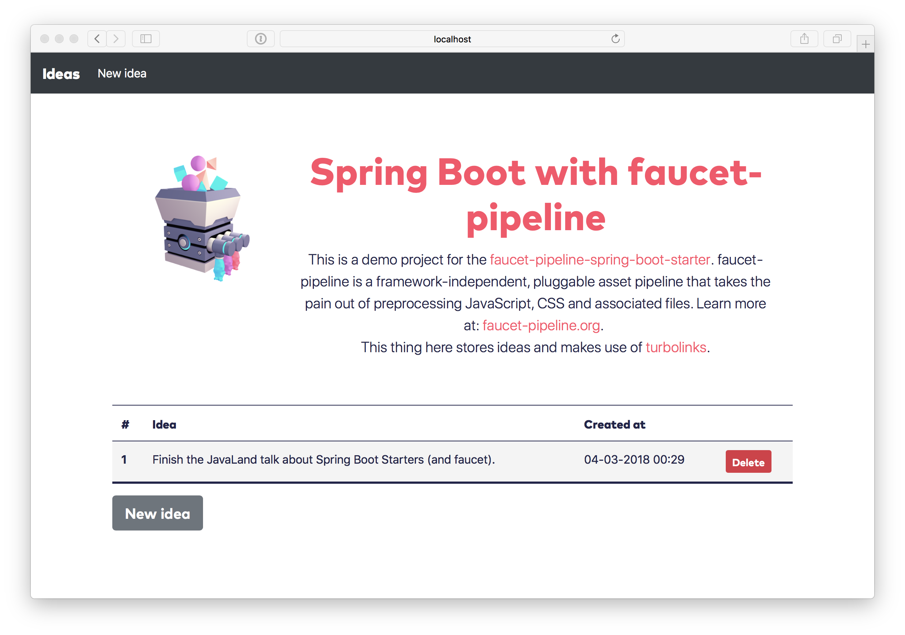

# faucet-pipeline-spring-boot-starter

A Spring Boot starter and auto-configuration for the [faucet-pipeline](http://www.faucet-pipeline.org):

> tl;dr: faucet-pipeline is a framework-independent, pluggable asset pipeline that takes the pain out of preprocessing JavaScript, CSS and associated files (e.g. images or fonts). It simplifies the process of converting modern JavaScript (ES6) to support older browsers (ES5), or Sass to CSS - eliminating typical low-level configuration nightmares.

The faucet-pipeline bundles your application files, fingerprints them and creates a manifest for them. It also can be used to watch the configured files and rerun the process during development.

## Introduction

This starter is needed when you want to use faucet with your [Spring Boot](https://projects.spring.io/spring-boot/) project. The following issues have to be tackled: 

* The resource processed through the pipeline ("assets") should not be part of the regular Java / Groovy / Kotlin sources and other resources of the project. As such, the assets would be copied by the build system (either Maven or Gradle) itself. You have to provide a place for the assets, this is not something the starter can do for you.
* The processed assets need to be in the class path of the Spring Application. This is also a build step, that the starter cannot do for you. 

What the starter does however are the following tasks:

* It checks whether a faucet-manifests exists (defaults to `classpath:/manifest.json`) and if so, loads it
* It checks whether the application is either a servlet or reactive web application. If not, the starter does nothing.
* For a web application it registers a `ResourceResolver` that is able to retrieve internal urls that might are the output of finger printing and map them to external urls. 

This works for servlet and reactive Spring applications.

## tl;dr

    git clone https://github.com/michael-simons/faucet-pipeline-spring-boot-starter
    cd faucet-pipeline-spring-boot-starter
    ./mvnw clean install
    cd demo-webmvc
    FAUCETPIPELINE_CACHEMANIFEST=false ./mvnw spring-boot:run 

Goto [localhost:8080](http://localhost:8080).

## Usage and configuration

### Runtime

Just include the starter in your pom.xml:

```
<dependency>
    <groupId>org.faucet-pipeline</groupId>
    <artifactId>faucet-pipeline-spring-boot-starter</artifactId>
    <version>0.0.1-SNAPSHOT</version>
</dependency>
```

The starter can only work if Springs [resource chain](https://docs.spring.io/spring/docs/5.0.4.RELEASE/spring-framework-reference/web.html#mvc-config-static-resources) is active. The starter won't activate this for you, so please configure

    spring.resources.chain.enabled=true

The resource resolver will be mapped to `/**`, so basically that's it.

### Compile time

Make sure that your assets end up into `/classes`. This project contains two demos, `demo-webmvc` and `demo-webflux`. The following approach is from `demo-webmvc`.

#### Configure your faucet-pipeline

Follow the instructions from the website:

    npm init # gets you a fresh package.json
    npm install --save\ # Installs the pipeline for you
          faucet-pipeline-js\
          faucet-pipeline-sass\
          faucet-pipeline-static
          
In your `package.json` add the following scripts:

    "scripts": {
        "compile": "faucet --fingerprint --compact",
        "watch": "faucet --no-fingerprint --watch"
    }
    
The `compact`-switch is optional.

Create a `faucet.config.js` next to `package.json`. Here's the one from `demo-webmvc`` 

    let targetBaseDir = "./target/classes/static"
    const path = require('path');
    
    module.exports = {
        js: [{
            source: "./src/main/assets/javascripts/application.js",
            target: targetBaseDir + "/javascripts/application.js"
        }],
        sass: [{
            source: "./src/main/assets/stylesheets/application.scss",
            target: targetBaseDir + "/stylesheets/application.css"
        }],
        static: [{
            source: "./src/main/assets/images",
            target: targetBaseDir + "/images"
        }],
        manifest: {
            file: "./target/classes/manifest.json",
            key: 'short',
            webRoot: targetBaseDir
        }
    };
    
You'll notice that it puts the all processed assets into `./target/classes/static`. That is where Spring Boot looks for static files by default. Pushing it directly into the classes folder allows dynamic reloading later on. An alternative would be going through `generated-resources`.

If you also opt for subdirectories for different kind of assets, you'll have to configure them in your Spring application as well:

    faucet-pipeline.path-patterns = /javascripts/**, /stylesheets/**, /images/**

#### Add `frontend-maven-plugin`

[frontend-maven-plugin](https://github.com/eirslett/frontend-maven-plugin) is "Maven-node-grunt-gulp-npm-node-plugin to end all maven-node-grunt-gulp-npm-plugins.":

With the `package.json` and faucet-configuration in place, add the following configuration:

    <plugin>
        <groupId>com.github.eirslett</groupId>
        <artifactId>frontend-maven-plugin</artifactId>
        <version>1.6</version>
        <executions>
            <execution>
                <id>install-node-and-npm</id>
                <goals>
                    <goal>install-node-and-npm</goal>
                </goals>
                <phase>generate-resources</phase>
                <configuration>
                    <nodeVersion>v9.5.0</nodeVersion>
                </configuration>
            </execution>
            <execution>
                <id>install-node-dependencies</id>
                <goals>
                    <goal>npm</goal>
                </goals>
            </execution>
            <execution>
                <id>run-faucet-pipeline</id>
                <goals>
                    <goal>npm</goal>
                </goals>
                <configuration>
                    <arguments>run compile --fingerprint</arguments>
                </configuration>
            </execution>
        </executions>
    </plugin>

This downloads Node and NPM and installs all dependencies via `package.json` and executes the pipeline during build. Assuming that your Spring Boot application has the Spring Boot Maven plugin configured like so

    <plugin>
        <groupId>org.springframework.boot</groupId>
        <artifactId>spring-boot-maven-plugin</artifactId>
    </plugin>
    
you can run the application with `mvn spring-boot:run`. When you use a supported template language like Thymeleaf and the URL-helper they offer, links to assets will contain the finger printed resources automatically. Those links 

    <link th:href="@{/stylesheets/application.css}" rel="stylesheet" data-turbolinks-track="reload">
    <script th:src="@{/javascripts/application.js}" data-turbolinks-track="reload"></script>

Will be turned into

    <link href="/stylesheets/stylesheets/application-70d5f3dc18d122548efadcedfc0874f0.css" rel="stylesheet" data-turbolinks-track="reload">
    <script src="/javascripts/javascripts/application-8af210bcc164a457cb381a627729320b.js" data-turbolinks-track="reload"></script> 

#### Automatic restart, manifest caching

Use `spring-boot-devtools` to automatically reload the application when things change:

    <dependency>
        <groupId>org.springframework.boot</groupId>
        <artifactId>spring-boot-devtools</artifactId>
    </dependency>

The manifest is cached by default but that can be turned off via `faucet-pipeline.cache-manifest = false`. One easy way to do this without hardcoding it into a properties file is as an environment variable:

Run the demo in one window like so:

    FAUCETPIPELINE_CACHEMANIFEST=false ./mvnw spring-boot:run
    
And in another terminal  

    npm run watch
    
And you'll see the assets being processed and refreshed in the app.

## About the demo application

Both demos - for WebMVC and Webflux - collect ideas. They use [Turbolinks](https://github.com/turbolinks/turbolinks) for quick navigation between server side rendered sites. Turbolinks come from [Ruby on Rails](http://rubyonrails.org). 

The demo is a Bootstrap-based site branded with the [INNOQ-theme](https://github.com/innoq/innoq-bootstrap-theme) and it looks like this:



